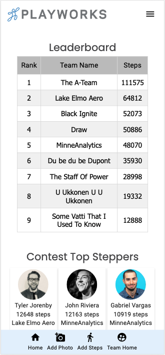
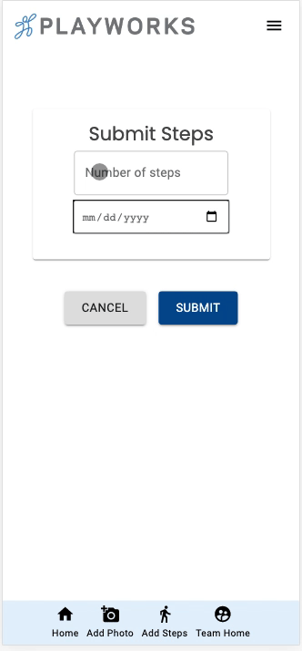
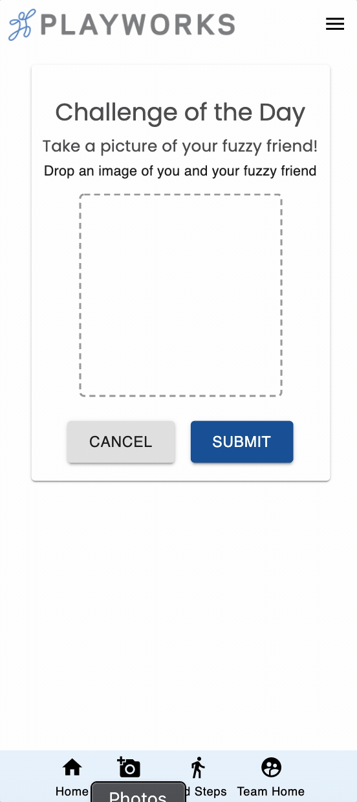

# PLAYWORKS STEP CHALLENGE APP

## Description

_Duration: 2 Weeks_

The Playworks Step Challenge App is a full stack mobile-first application that allows users to create or join a team, log steps, and view team and user statistics. Application allows users to upload images based on challenges that are assigned by the Playworks admins. These images will be displayed in multiple image feeds to encourage user interaction. When a team is created by a user, that user is a “captain” giving that user the ability to remove users from the team and approve or deny photos that are uploaded by the team members.

### Prerequisites

To run this app, make sure you have the following installed on your computer:

- Node.js
- Postgres
- Nodemon
- Heroku

## Database Setup

- Create a new database called `playworks_step_challenge`
- Run the SQL Query outlined in the database.sql file
- Note: If you would like to use a different database name, update the database name in `server/modules/pool.js`
- Note: Project is setup to run on Heroku (see instructions below)

## Deployment

- Create a new Heroku project
- Link the Heroku project to the project GitHub Repo
- Create an Heroku Postgres database
- Connect to the Heroku Postgres database from Postico
- Create the necessary tables
- Add an environment variable for `SERVER_SESSION_SECRET` with a nice random string for security
- In the deploy section, select manual deploy

## Installation

- Open this repo in your editor of choice and run the `npm install` in your terminal
- `npm run server` in your terminal
- `npm run client` in your terminal
- Note: The `npm run client` command will automatically open up a new browser tab for you!

## Built With

- Node
- Express
- React
- Redux
- Sagas
- PostgreSQL
- Passport
- Material UI
- AWS S3
- Heroku

## Acknowledgement
HUGE thanks to Edan, dEv, and Casie for all of their fantastic instruction, wisdom, and continued support! Also, shoutout to [Prime Digital Academy](www.primeacademy.io) who gave us the opportunity to create this app. And last (but certainly not least), shoutout to all of our family in the Tarjan cohort for being great friends and helping us get through this fun and exciting journey! SWING SWING!

## Support
If you have suggestions or issues, please email the team [tarjanplayworks@gmail.com](www.google.com)

# playworks
